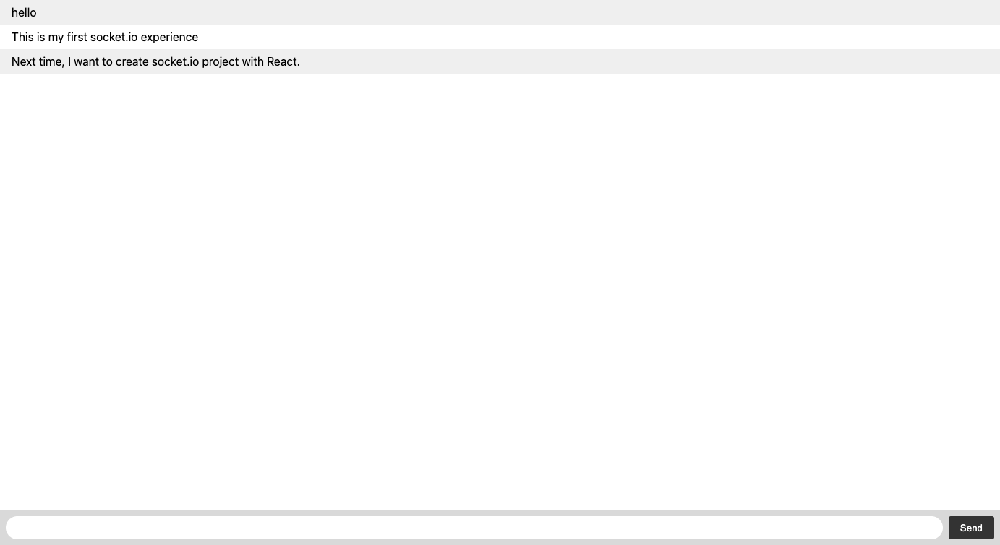

# My-First-Socket.io

This is My First Socket.io project.
The project is from documentation (https://socket.io/get-started/chat)

Nothing fancy.
But, always, fundamentals is very very important for programmers.

Now, I am creating MERN Social Media application like instagram. And, I want to create  real time message function in the app.
So, this project is an indispensable for me.

I got the basis knowledge now. 
And next, I would like to create simple Socket.io application with React.js. 
(Of course, I am going to proceed my social app, too. But before, I would like to learn how to connect socket.io with React.js)

This is very simple project. 
So, I do not deploy demosite.

### Env Variables (.env)

"PORT": "your port here"  

Thank you for reading.
And, happy coding!!
